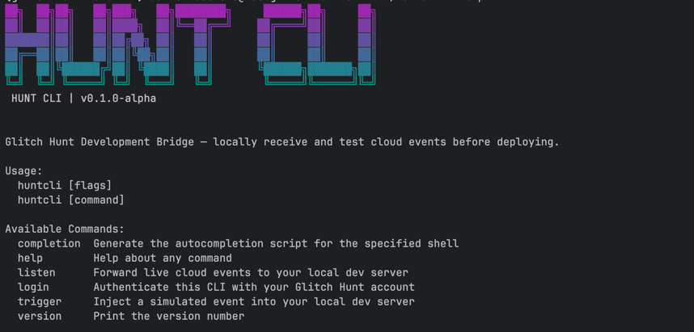

# HUNT CLI — Glitch Hunt Development Bridge



The HUNT CLI is a lightweight, single-binary tool that securely streams live cloud events from the Glitch Hunt platform to your local development machine. It eliminates the need for public reverse proxies, firewall configuration, or static IP addresses during local development.

---

## Purpose

The HUNT CLI bridges the gap between cloud-based event processing and local development. Instead of deploying untested webhook handlers to production or fighting with network configuration, developers can receive the exact same event payloads locally that their production systems will receive.

The CLI connects to the Glitch Hunt cloud via a secure outbound WebSocket connection — which firewalls and NATs permit automatically — and forwards every event as a standard HTTP POST to a local development server of your choice.

---

## Commands

| Command | Description |
|---------|-------------|
| `huntcli login` | Authenticate the CLI by pairing with a Glitch Hunt account. Generates a pairing code and QR code; claim the device through the web UI to complete setup. |
| `huntcli listen` | Connect to the Glitch Hunt cloud and forward live events as HTTP POST requests to a local development server. Supports filtering by event type. |
| `huntcli trigger` | Inject a simulated event directly into a local server for offline testing. All payloads use the same UnifiedEvent JSON schema as production events. |
| `huntcli version` | Print the installed version of the CLI. |

---

## Quick Start

### 1. Download

Pre-built binaries are available on the [releases page](https://github.com/MonteChristo46/glitch-hunt-cli/releases):

```bash
curl -sL https://github.com/MonteChristo46/glitch-hunt-cli/releases/latest/download/huntcli-darwin-arm64 -o huntcli
chmod +x ./huntcli
```

Platform-specific binaries: `darwin-amd64`, `darwin-arm64`, `linux-amd64`, `linux-arm64`, `windows-amd64.exe`.

### 2. Authenticate

```bash
./huntcli login
```

This generates a pairing code and displays a QR code. Open the URL in a browser, log into the Glitch Hunt web application, and claim the device. The authentication token is saved to `~/.config/hunt/config.json` and reused automatically.

### 3. Start forwarding events

```bash
./huntcli listen --forward-to http://localhost:8080/webhooks
```

Every cloud event is forwarded as an HTTP POST with `Content-Type: application/json` and an `X-Event-Type` header identifying the event type.

### 4. Test offline

```bash
./huntcli trigger ai.anomaly-detected
```

Sends a simulated event to the local server without any cloud dependency, allowing rapid iteration on webhook handler logic.

---

## Event Types

The CLI supports all event types produced by the Glitch Hunt platform:

- **INGESTED** — File uploaded by an edge device
- **AI_COMPLETED** — AI finished processing an image
- **AI_ANOMALY_DETECTED** — AI found a probable defect
- **AI_EDGE_CASE_DETECTED** — AI result is near the decision boundary
- **AI_NORMAL** — AI confirmed the part is within specification
- **ANOMALY_CONFIRMED_MANUAL** — Operator confirmed an AI-detected anomaly
- **ANOMALY_REJECTED_MANUAL** — Operator marked an AI result as a false positive
- **NORMAL_CONFIRMED_MANUAL** — Operator confirmed a normal result
- **DEFECT_MISSED_MANUAL** — Operator found a defect the AI did not flag
- **REVIEW_UNCLEAR_MANUAL** — Operator could not determine the outcome

---

## Trigger Payloads

The `trigger` command accepts the following event type identifiers, each producing a realistic payload matching the production UnifiedEvent schema:

| Identifier | Event Type | Description |
|---|---|---|
| `file.uploaded` | INGESTED | File upload from an edge device |
| `ai.completed` | AI_COMPLETED | Normal AI result (confidence 0.02) |
| `ai.anomaly` | AI_COMPLETED | Anomaly detected (confidence 0.94) |
| `ai.edge-case` | AI_COMPLETED | Borderline result (confidence 0.48) |
| `ai.anomaly-detected` | AI_ANOMALY_DETECTED | Defect found (confidence 0.97) |
| `ai.edge-case-detected` | AI_EDGE_CASE_DETECTED | Borderline result (confidence 0.49) |
| `ai.normal` | AI_NORMAL | No defect (confidence 0.02) |
| `review.anomaly-confirmed` | ANOMALY_CONFIRMED_MANUAL | TRUE_POSITIVE annotation |
| `review.anomaly-rejected` | ANOMALY_REJECTED_MANUAL | FALSE_POSITIVE annotation |
| `review.normal-confirmed` | NORMAL_CONFIRMED_MANUAL | TRUE_NEGATIVE annotation |
| `review.defect-missed` | DEFECT_MISSED_MANUAL | FALSE_NEGATIVE annotation |
| `review.unclear` | REVIEW_UNCLEAR_MANUAL | Operator annotation |

---

## Building from Source

Requirements: Go 1.25 or later.

```bash
git clone https://github.com/MonteChristo46/glitch-hunt-cli.git
cd glitch-hunt-cli
go build -o huntcli ./cmd/huntcli/
```

Cross-platform builds are available via the included `build.sh` script.

---

## Configuration

The CLI stores its configuration at `~/.config/hunt/config.json`:

```json
{
  "api_endpoint": "https://glitch-hunt-central-api.my-basement.cloud",
  "ingest_endpoint": "https://glitch-hunt-ingestion.my-basement.cloud",
  "web_client_url": "https://glitch-hunt.my-basement.cloud",
  "default_forward_url": "http://localhost:8080/webhooks",
  "device_id": "huntcli-aa-bb-cc-dd-ee-ff",
  "auth_token": ""
}
```

The `default_forward_url` can be changed to avoid passing `--forward-to` on every invocation.

---

## Related Projects

- [fs-ingest-daemon](https://github.com/MonteChristo46/fs-ingest-daemon) — Edge daemon for production hardware that watches local folders and uploads images to the Glitch Hunt cloud.
- [glitch-hunt-central-api](https://github.com/MonteChristo46/glitch-hunt-central-api) — The central API that processes images and emits events consumed by this CLI.
